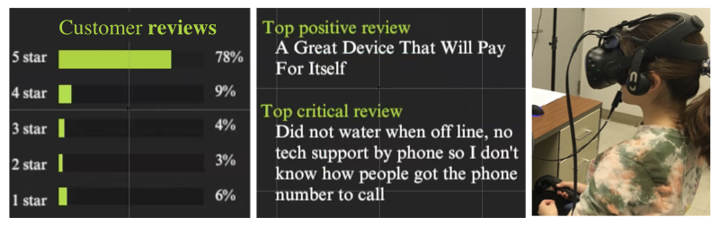
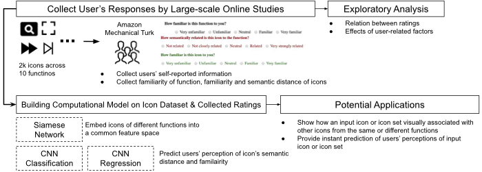
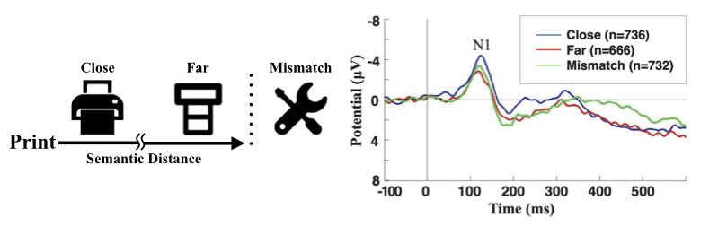
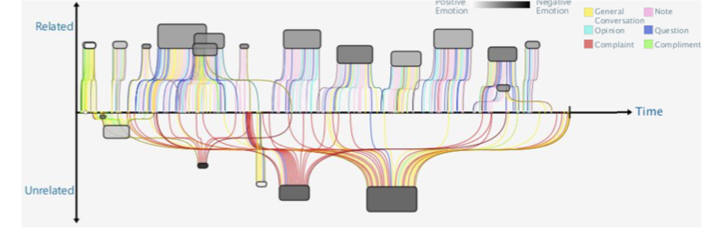

# Hello!
I am Fu-Yin Cherng (程芙茵), currently serving as a tenure-track assistant professor in the [Department of Computer Science and Information Engineering at National Chung Cheng University](https://cs.ccu.edu.tw/?Lang=en). 
I also served as a committee member for the [Best Practices Working Group](https://sigchi.org/people/all-committees/) in SIGCHI.

My research combines human-computer interaction, data science, and physiological sensing to enhance user interactions with technology. My areas of expertise include Human-Computer Interaction, Brain-Computer Interface, Neuroergonomics, Learning Analytics, and Data-Driven Design.
I have had the privilege to work with renowned professors and researchers in various institutions. I was a research assistant and a Ph.D. candidate (advisor: [Prof. Wen-Chieh (Steve) Lin](https://gpl.cs.nctu.edu.tw/members/)) at National Yang-Ming Chiao Tung University from 2013 to 2019, then worked as a doctoral research assistant at École Polytechnique fédérale de Lausanne (EPFL) from 2016-2017. Later, I worked as a postdoctoral researcher at UC Davis with [Prof. Hao-Chuan Wang](https://www.haochuanwang.info/) in 2019-2020 and with [Prof. Bing-Yu Chen](http://graphics.im.ntu.edu.tw/~robin/) at National Taiwan University in 2020-2021.

# Selected Publications
_Here are my selected publications. Please refer to [Google Scholar](https://scholar.google.com.hk/citations?user=RNihHkMAAAAJ&hl=zh-TW) or [dblp](https://dblp.org/pers/c/Cherng:Fu=Yin.html) for my complete publication list._

Chung, Yu-Jung, Chen-Wei Hsu, Meng-Hsun Chan, and **Fu-Yin Cherng**. "Enhancing ESL Learners’ Experience and Performance through Gradual Adjustment of Video Speed during Extensive Viewing." Proceedings of the SIGCHI Conference on Human Factors in Computing Systems. ACM, 2024. [[paper]]()

I-Chao Shen, **Fu-Yin Cherng**, Takeo Igarashi, Wen-Chieh Lin, Bing-Yu Chen. "EvIcon: Designing High-Usability Icon with Human-in-the-loop Exploration and IconCLIP." Computer Graphics Forum, 2023 (SCI). [[paper]](https://onlinelibrary.wiley.com/doi/10.1111/cgf.14924)

**Fu-Yin Cherng**, Jingchao Fang, Yinhao Jiang, Xin Chen, Taejun Choi, Hao-Chuan Wang. "Understanding Social Influence in Collective Product Ratings Using Behavioral and Cognitive Metrics" Proceedings of the SIGCHI Conference on Human Factors in Computing Systems. ACM, 2022. [[paper]](https://dl.acm.org/doi/10.1145/3491102.3517726)[[video]](https://www.youtube.com/watch?v=TTcGIK-l7TE)

**Fu-Yin Cherng**, Wen-Chieh Lin, Jung-Tai King, Yi-Chen Lee. ”Measuring the Influences of Musical Parameters on Cognitive and Behavioral Responses to Audio Notifications Using EEG and Large-scale Online Studies” Proceedings of the SIGCHI Conference on Human Factors in Computing Systems. ACM, 2019. [[paper]](https://dl.acm.org/citation.cfm?id=3300639)[[slides]](docs/CHI19_MusicalParameters.pdf)[[video]](https://www.youtube.com/watch?v=_uW_ibwi3Qs)[[Github]](https://github.com/FuyinCherng/CHI18_EEGAudioNoti)

Yi-Chen Lee, **Fu-Yin Cherng**, Wen-Chieh Lin, Jung-Tai King. ”To Repeat or Not to Repeat?: Redesigning Repeating Auditory Alarms Based on EEG Analysis” Proceedings of the SIGCHI Conference on Human Factors in Computing Systems. ACM, 2019. [[paper]](https://dl.acm.org/citation.cfm?id=3300743)[[slides]](docs/CHI19_Repeat.pdf)[[video]](https://www.youtube.com/watch?v=_01LNc2w3XU)

# Research Projects
## Social Preference Effect in E-Commerce Context

_2019 - present, UC Davis, [CSC Lab](http://www.haochuanwang.info/) and [Looxid Labs](https://looxidlabs.com/mobile-home/)_

We studied users' internal and external preference and effects of social conformity. Through self-report and biometric measures, we derived design implications for supporting users' decision-making process.

_Technologies: Social Computing, Neuromarketing, Virtual Reality_

Resource: [[Paper - CHI 2022]](https://dl.acm.org/doi/10.1145/3491102.3517726) [[Presentation Info - CHI 2022]](https://programs.sigchi.org/chi/2022/program/content/72168) [[Presentation Video - CHI 2022]](https://www.youtube.com/watch?v=TTcGIK-l7TE)

******

## Large-scale Online Studies for Graphic and Audio Icons

_2017 - 2019, National Chiao Tung University, [Graphics and Perception Lab](https://gpl.cs.nctu.edu.tw)_

We collected and curated massive data with over 2k online workers rated 10k icons and achieved accuracy of 85% on predicting users' feedback using CNN models. The feature space of icons with different functions was constructed using Siamese network. Moreover, we studied effects of demographics, experience, and contexts on feedback to icons.

_Technologies: Full-stack Development, Data-driven Design, Convolutional Neural Network_

Resource: [[Paper - CHI 2019]](https://dl.acm.org/citation.cfm?id=3300639)[[Slides]](docs/CHI19_MusicalParameters.pdf)[[Video]](https://www.youtube.com/watch?v=_uW_ibwi3Qs)[[Github]](https://github.com/FuyinCherng/CHI18_EEGAudioNoti)

******

## Brain Sensing Techniques on Evaluating Design and Usability

_2014 - 2018, National Chiao Tung University, [Graphics and Perception Lab](https://gpl.cs.nctu.edu.tw)_

We collected users' brain signals (i.e., Electroencephalography, short for EEG) and applied Matlab toolboxes to process brain signals for offline and online analysis.
We not only uncovered the underlying cognitive states to complement the results of behavioral and self-report evaluation, but also delivered design suggestions which based on cognitive evidences.

_Technologies: Physiological Data Analysis, Experiment Design, Cognitive Psychology_

Resource: [[Paper - CHI 2014 (Honorable Mention Award)]](https://dl.acm.org/citation.cfm?id=2557076)[[Paper - CHI 2016 (Honorable Mention Award)]](https://dl.acm.org/citation.cfm?id=2858133)[[Slides - CHI 2016]](docs/CHI2016_slides.pdf)[[Video]](https://www.youtube.com/watch?v=ElV_1hyAsm8)

******

## Time-anchored Peer Comments in Online Learning

_2015 - 2017, National Chiao Tung University, [Graphics and Perception Lab](https://gpl.cs.nctu.edu.tw)_

We designed an online learning website with an interactive commenting system and prototyped interface to visualize comments with topic and sentiment analysis. Usability testing and factorial experiment with learners and instructors was conducted to evaluate the effect and desired benefits of our systems. We reported the evaluation result in both qualitatively and quantitatively fashions.

_Technologies: Online Learning, Visualization, Usability Testing, Statistical Analysis_

Resource: [[Paper - Computer Graphics Forum 2017]](https://onlinelibrary.wiley.com/doi/abs/10.1111/cgf.13280)[[Paper - CHI 2015]](https://dl.acm.org/citation.cfm?id=2702349)[[Slides - CHI 2015]](docs/CHI2015_slides.pdf)[[Video - CHI 2015]](https://www.youtube.com/watch?v=X34Xp8NY7dM)
