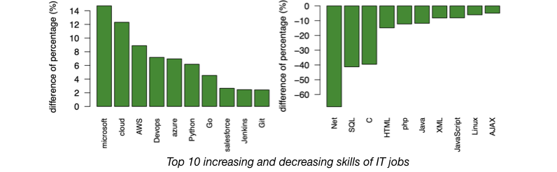
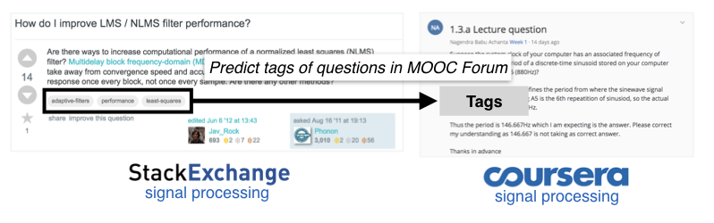

# Hello!
I'm Fu-Yin Cherng (程芙茵). I'm currently an adjunct assistant professor in the Department of Information Management at the National Taiwan University. I also conducted my postdoctoral research with [Prof. Bing-Yu Chen](http://graphics.im.ntu.edu.tw/~robin/). I design interdisciplinary research plans (e.g., human-computer interaction, data science, and sensing of physiological data) for evaluating users’ behaviors and perceptions qualitatively and quantitatively to the industrial and academic collaborators. My research interests include Human-Computer Interaction, Brain-Computer Interface, Neuroergonomics, Learning Analytics, and Data-Driven Design.

I started working with [Prof. Hao-Chuan Wang](http://www.haochuanwang.info/) at [UC Davis](https://www.ucdavis.edu/) as a postdoctoral researcher during 2019 to 2020. I was a doctoral research assistant in the [CHILI Lab](https://www.epfl.ch/labs/chili/) at [École polytechnique fédérale de Lausanne (EPFL)](https://www.epfl.ch/en/home/) from 2016 to 2017. During 2013 to 2019, I was a research assistant and PhD Candidate in the [Graphics and Perception Labs](https://gpl.cs.nctu.edu.tw) lead by [Prof Wen-Chieh Lin](https://gpl.cs.nctu.edu.tw/Steve-Lin/) at [NCTU](https://www.nctu.edu.tw/).

# Research Projects
## Social Preference Effect in E-Commerce Context

_2019 - Present, UC Davis, [CSC Lab](http://www.haochuanwang.info/) and [Looxid Labs](https://looxidlabs.com/mobile-home/)_

We studied users' internal and external preference and effects of social conformity. Through self-report and biometric measures, we derived design implications for supporting users' decision-making process.

_Technologies: Social Computing, Neuromarketing, Virtual Reality_

******

## Large-scale Online Studies for Graphic and Audio Icons

_2017 - 2019, National Chiao Tung University, [Graphics and Perception Lab](https://gpl.cs.nctu.edu.tw)_

We collected and curated massive data with over 2k online workers rated 10k icons and achieved accuracy of 85% on predicting users' feedback using CNN models. The feature space of icons with different functions was constructed using Siamese network. Moreover, we studied effects of demographics, experience, and contexts on feedback to icons.

_Technologies: Full-stack Development, Data-driven Design, Convolutional Neural Network_

Resource: [[Paper]](https://dl.acm.org/citation.cfm?id=3300639)[[Slides]](docs/CHI19_MusicalParameters.pdf)[[Video]](https://www.youtube.com/watch?v=_uW_ibwi3Qs)[[Github]](https://github.com/FuyinCherng/CHI18_EEGAudioNoti)

******

## Brain Sensing Techniques on Evaluating Design and Usability

_2014 - 2018, National Chiao Tung University, [Graphics and Perception Lab](https://gpl.cs.nctu.edu.tw)_

We collected users' brain signals (i.e., Electroencephalography, short for EEG) and applied Matlab toolboxes to process brain signals for offline and online analysis.
We not only uncovered the underlying cognitive states to complement the results of behavioral and self-report evaluation, but also delivered design suggestions which based on cognitive evidences.

_Technologies: Physiological Data Analysis, Experiment Design, Cognitive Psychology_

Resource: [[Paper - CHI 2014 (Honorable Mention Award)]](https://dl.acm.org/citation.cfm?id=2557076)[[Paper - CHI 2016 (Honorable Mention Award)]](https://dl.acm.org/citation.cfm?id=2858133)[[Slides - CHI 2016]](docs/CHI2016_slides.pdf)[[Video]](https://www.youtube.com/watch?v=ElV_1hyAsm8)

******

## Time-anchored Peer Comments in Online Learning

_2015 - 2017, National Chiao Tung University, [Graphics and Perception Lab](https://gpl.cs.nctu.edu.tw)_

We designed an online learning website with an interactive commenting system and prototyped interface to visualize comments with topic and sentiment analysis. Usability testing and factorial experiment with learners and instructors was conducted to evaluate the effect and desired benefits of our systems. We reported the evaluation result in both qualitatively and quantitatively fashions.

_Technologies: Online Learning, Visualization, Usability Testing, Statistical Analysis_

Resource: [[Paper - Computer Graphics Forum 2017]](https://onlinelibrary.wiley.com/doi/abs/10.1111/cgf.13280)[[Paper - CHI 2015]](https://dl.acm.org/citation.cfm?id=2702349)[[Slides - CHI 2015]](docs/CHI2015_slides.pdf)[[Video - CHI 2015]](https://www.youtube.com/watch?v=X34Xp8NY7dM)

******

## Detect Hidden Training Needs Using Job Advertisements

_2017, EPFL, [Computer-Human Interaction in Learning and Instruction Lab](https://www.epfl.ch/labs/chili/)_

In this project, we analyzed job titles and skills from 600k job ads to understand the changes in requirement of different technical skills.
Hence, we developed framework to scrap and aggregate job ads (e.g., normalizing job titles from different job ads) from multiple job boards and conducted cross dataset analysis between job ads and Google Trends.

_Technologies: Data Wrangling, Natural Language Processing, Trend Detection_

Resource: [[Report]](docs/JobAdsAnalysis_report.pdf)[[Slides]](docs/DualT_advisory_FuyinCherng.pdf)[[Github - Dataset]](https://github.com/FuyinCherng/Job-Ads-Analysis)[[Github - Scraping Program]](https://github.com/FuyinCherng/job-ads-scrap)

******

## Finding Question Topics in MOOCs Forum by Using Stack Exchange

_2016, EPFL, [Computer-Human Interaction in Learning and Instruction Lab](https://www.epfl.ch/labs/chili/)_

We want to detect the topics of questions that are asked most frequently in the discussion forum of Coursera, so we want to use the user-generated tags of the posts in StackExchange to automatically predict the tags of the questions in Coursera.
We first measured divergence of word distributions between the two platforms using cross-entropy, and KL and JS divergence, and L1 and L2 distance. We achieved mean accuracy of 88% on predicting tags for online posts.

_Technologies: Machine Learning, Multi-label Classifier, Clustering, Word Embedding_

Resource: [[Report]](docs/2016Fall_semesterProject.pdf)[[Github - Document Similarity]](https://github.com/FuyinCherng/doc-similarity)

# Skills
### Knowledge Fields and Research Interests
Human-computer Interaction, User Experience, Quantitative Methodology, Data-driven Design, Crowdsourcing, Cognitive Psychology, Natural Languages Processing, Machine Learning, Statistical Analysis

### Programming Languages
C, C++, Java, Python, CSS, HTML, JavaScript, PHP, SQL, R, Matlab, LaTeX, Markdown

### Open-source Libraries
Keras, PyTorch, Numpy, Pandas, Scikit-learn, Gensim, OpenCV, PIL, Firebase, Jupyter Notebook, Google Cloud Platform, Jekyll, Github, Spark, Apache Hadoop

# Selected Publications
_Here are my selected publications. Please refer to [Google Scholar](https://scholar.google.com.hk/citations?user=RNihHkMAAAAJ&hl=zh-TW) or [dblp](https://dblp.org/pers/c/Cherng:Fu=Yin.html) for my complete publication list._

**Fu-Yin Cherng**, Wen-Chieh Lin, Jung-Tai King, Yi-Chen Lee. ”Measuring the Influences of Musical Parameters on Cognitive and Behavioral Responses to Audio Notifications Using EEG and Large-scale Online Studies” Proceedings of the SIGCHI Conference on Human Factors in Computing Systems. ACM, 2019. [[paper]](https://dl.acm.org/citation.cfm?id=3300639)[[slides]](docs/CHI19_MusicalParameters.pdf)[[video]](https://www.youtube.com/watch?v=_uW_ibwi3Qs)[[Github]](https://github.com/FuyinCherng/CHI18_EEGAudioNoti)

Yi-Chen Lee, **Fu-Yin Cherng**, Wen-Chieh Lin, Jung-Tai King. ”To Repeat or Not to Repeat?: Redesigning Repeating Auditory Alarms Based on EEG Analysis” Proceedings of the SIGCHI Conference on Human Factors in Computing Systems. ACM, 2019. [[paper]](https://dl.acm.org/citation.cfm?id=3300743)[[slides]](docs/CHI19_Repeat.pdf)[[video]](https://www.youtube.com/watch?v=_01LNc2w3XU)

**Fu-Yin Cherng**, Wen-Chieh Lin, Jung-Tai King, Yi-Chen Lee. ”Understanding the Influence of Musical Parameters on Cognitive Responses of Audio Notifications” Extended Abstracts of the 2018 CHI Conference on Human Factors in Computing Systems. ACM, 2018. [[paper]](https://dl.acm.org/citation.cfm?id=3188572)[[poster]](docs/poster_LBW18_final.pdf)

**Fu-Yin Cherng**, Wen-Chieh Lin, Jung-Tai King, Yi-Chen Lee. ”An EEG-based Approach for Evaluating Graphic Icons from the Perspective of Semantic Distance” Proceedings of the SIGCHI Conference on Human Factors in Computing Systems. ACM, 2016 **(Honorable Mention Award, 4% of over 2,000 submissions)**. [[paper]](https://dl.acm.org/citation.cfm?id=2858133)[[slides]](docs/CHI2016_slides.pdf)[[video]](https://www.youtube.com/watch?v=ElV_1hyAsm8)

Yi-Chieh Lee, Wen-Chieh Lin, **Fu-Yin Cherng**, Hao-Chuan Wang, Ching-Ying Sung, Jung-Tai King. ”Using Time-Anchored Peer Commenting to Enhance Social Interaction in Online Educational Videos” Proceedings of the SIGCHI Conference on Human Factors in Computing Systems. ACM, 2015 [[paper]](https://dl.acm.org/citation.cfm?id=2702349)[[slides]](docs/CHI2015_slides.pdf)[[video]](https://www.youtube.com/watch?v=X34Xp8NY7dM)

Yi-Chieh Lee, Wen-Chieh Lin, Jung-Tai King, Li-Wei Ko, Yu-Ting Huang, **Fu-Yin Cherng**. ”An EEG-based Approach for Evaluating Audio Notifications under Ambient Sounds” Proceedings of the SIGCHI Conference on Human Factors in Computing Systems. ACM, 2014 **(Honorable Mention Award, 5% of over 2,000 submissions)**. [[paper]](https://dl.acm.org/citation.cfm?id=2557076)[[video]](https://www.youtube.com/watch?v=XkH5CWVpvws)
