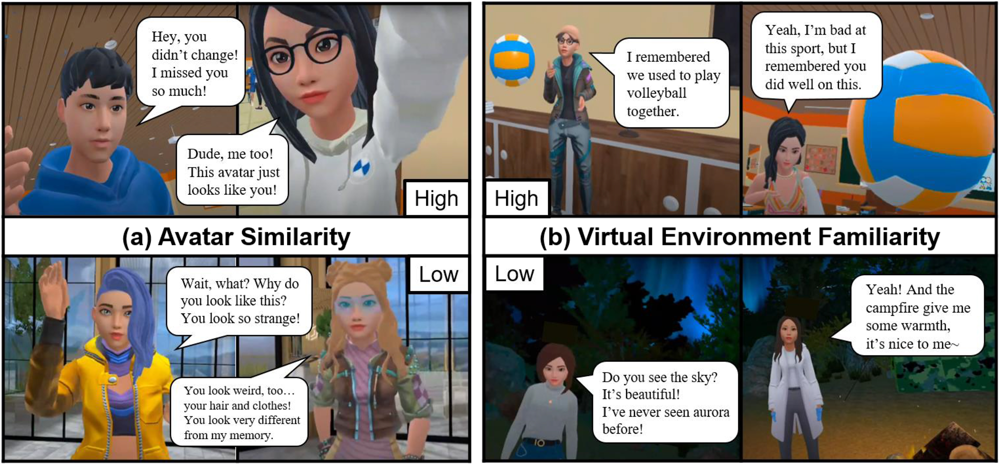
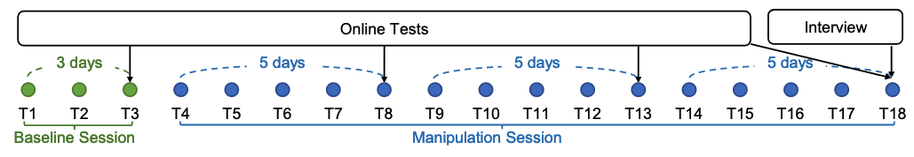
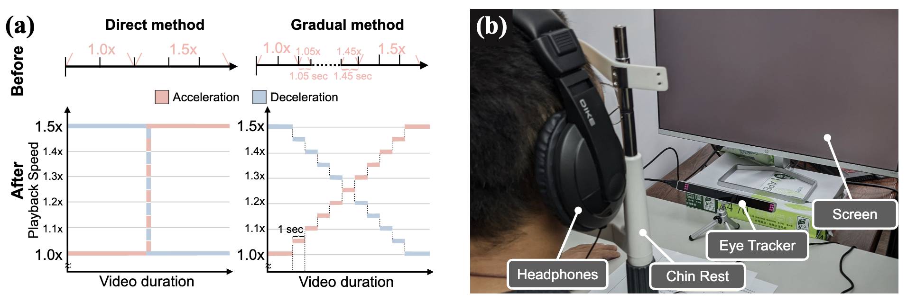

# Hello!
I am Fu-Yin Cherng (程芙茵), currently a tenure-track assistant professor in the Department of Computer Science and Information Engineering at National Cheng Kung University, starting from Feb. 2026. 
My research interests include **Human-Computer Interaction (HCI), Human-Centered AI (HCAI)/Human-AI Interaction (HAI), Neuroergonomics, Brain-Computer Interface, Technology-Supported Learning, Data-Driven Design**. 

My research vision is to uncover how contemporary information formats, such as online comments and short-form videos, shape cognitive processes, behaviors, and decision-making. I achieve this vision by integrating physiological data from brain-sensing and eye-tracking.
Guided by these physiological insights, my ultimate goal is to provide design recommendations that augment user cognition while preserving autonomy. My work applies this unique approach to crucial domains, including collective and peer commentary, online and programming education, and notification design.

## Education & Professional Experience
- **Assistant Professor**, National Cheng Kung University, Taiwan (2026-present)
- **Assistant Professor**, National Chung Cheng University, Taiwan (2021-2026)
- **Adjunct Assistant Professor**, National Taiwan University, Taiwan (2020-2021)
- **Postdoctoral Researcher**, National Taiwan University, Taiwan (2020-2021) _Advisor: Prof. Bing-Yu (Robin) Chen_
- **Postdoctoral Researcher**, University of California, Davis, USA (2019-2020) _Advisor: Prof. Hao-Chuan Wang_
- **Ph.D., Computer Science**, National Yang-Ming Chiao Tung University, Taiwan (2013-2019) _Advisor: Prof. Wen-Chieh (Steve) Lin_
- **Doctoral Research Assistant**, École Polytechnique Fédérale de Lausanne (EPFL), Switzerland (2016-2017) _Advisor: Prof. Pierre Dillenbourg_
- **B.S., Computer Science**, National Yang-Ming Chiao Tung University, Taiwan (2009-2013)

## Research Project Highlight

### Reconnecting Dormant Ties in Virtual Reality

_2022 - 2025, National Chung Cheng University_

This paper investigates the potential of Virtual Reality (VR) to facilitate the reactivation of dormant social ties, which is beneficial for well-being and reducing loneliness. An experiment involving 24 dyads found that avatar resemblance and virtual environments significantly influence social closeness and conversation, suggesting that VR features can be tailored to help people reconnect.

_Keywords: Virtual Reality, Dormant Ties, Avatar Similarity, Virtual Environment, Nostalgia_

Resource: [[Paper - IEEE TVCG 2025]](https://ieeexplore.ieee.org/abstract/document/11180930/) [[Video (Chinese)]](https://www.youtube.com/watch?v=AOP_xJjA98I)

******

### Short-form Video and Sustained Attention

_2023 - 2024, National Chung Cheng University_

This study explored the relationship between short-form video consumption and sustained attention. Through an online survey using a psychological test, we found that consuming more short-form videos is associated with poorer sustained attention. However, a follow-up long-term field experiment with regular sustained attention tests showed that changing the amount of time spent watching short-form videos did not significantly alter performance on these tests. These findings offer a preliminary look into the effects of short-form videos on sustained attention.

_Keywords: Short Video, Sustained Attention_

Resource: [[Paper - CHI 2024 LBW]](https://dl.acm.org/doi/abs/10.1145/3613905.3651018) [[Presentation Video - CHI 2024 LBW]](https://youtu.be/gaoniTdMlwQ)

******

### ESL Learning and Video Speed

_2023 - 2024, National Chung Cheng University_

We studied how different methods of adjusting video playback speed—direct versus gradual—affect English-as-a-Second-Language (ESL) learners. Using both objective metrics like pupil diameter and subjective survey feedback from 32 participants, we found that gradual adjustments were superior. This method enhanced the learners' flow state and video comprehension while being less distracting. 

_Keywords: Educational Technology, Extensive Viewing, Cognitive Load, Flow State_

Resource: [[Paper - CHI 2024]](https://dl.acm.org/doi/abs/10.1145/3613904.3642366) [[Presentation Video - CHI 2024]](https://youtu.be/byKymfzLrw0)

******

### Social Preference Effect in E-Commerce Context

_2019 - 2022, UC Davis_

We studied how displaying collective information, such as social ratings and reviews, influences users' decision-making. We used EEG signals to assess the cognitive responses of participants in a laboratory study. The results indicated that social information can alter user preferences and affect their attention, working memory, and emotions. Our predictive analysis also found that EEG-based measures are more powerful than behavioral measures at determining how this collective information is presented. The findings offer design implications for systems that use collective ratings.

_Keywords: Social Computing, Neuromarketing, Virtual Reality_

Resource: [[Paper - CHI 2022]](https://dl.acm.org/doi/10.1145/3491102.3517726) [[Presentation Video - CHI 2022]](https://www.youtube.com/watch?v=TTcGIK-l7TE)

******

## Course and Teaching Statement
As a student who struggles with traditional assessments like exams, I advocate for **project-based learning** and believe **collaborative learning** is essential. To support this, I design various in-class activities and open discussions, along with semester-long group projects that showcase diverse competencies. Also, I have taught several English as a Medium of Instruction (EMI) courses, which I believe are crucial for helping students connect with the international community. 

### Programming Design I & II
- This mandatory undergraduate EMI course is taught from 2021 to 2025, introducing foundational programming in C.
- The average class size is approximately 100 students each year.
- The course consistently receives a mean feedback score of no lower than 4.5 out of 5 each year.
- [[Example Syllabus: Program Design I]](docs/PD1.pdf) [[Example Syllabus: Program Design II]](docs/PD2.pdf) [[Example of Project Description]](docs/PD2_Project.pdf)

### Human-Computer Interaction and Method of User Research 
- This optional graduate course is taught in 2022 (EMI) and 2023, introducing Human-Computer Interaction.
- The average class size is approximately 20 students, and I actively engaged them through in-class activities such as group discussions, design thinking exercises, and innovative collaborative games. 
- The course was awarded the Excellent Courses Award (教學意見調查優良課程) and received a mean feedback score of nearly 4.9 out of 5.
- [[Example Syllabus]](docs/HCI_MUR.pdf)

## Grants
### Principal Investigator
- **2025-2027:** Enhancing Emotion Regulation and Affective Grounding in Instant Messaging and Group Chat through AI-Mediated Communication, National Science and Technology Council (NSTC)
- **2025:** Application of Human-Computer Interaction Design in Retrieval-Augmented Generation for Question Answering, Industry-academia Collaboration with Industrial Technology Research Institute (ITRI)
- **2024-2025:** Understanding the Short-term and Long-term Relationship between Short-form Video Consumption and Sustained Attention, National Science and Technology Council (NSTC)
- **2022-2024:** Neuroprint: Neuroprint: Promoting Credible Collective Reviews through Developing Neural-based Multimodal Metrics of Social Influence and Intention, National Science and Technology Council (NSTC)

### Co-Principal Investigator
- **2025-2028:** Developing a Highly Accurate and Trustworthy Community Fraud Prevention Mechanism for Public and Private Messages, National Science and Technology Council (NSTC)
- **2021-2022:** Nurturing STEM and Female Talent in Higher Education–Cross-Disciplinary Maker Talent Development Program for AI Industry Ministry of Education
