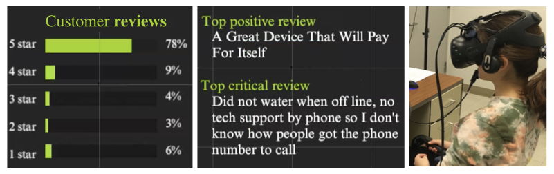

# Hello! :wave:
I am Fu-Yin Cherng (程芙茵), currently a tenure-track assistant professor in the Department of Computer Science and Information Engineering at National Chung Cheng University since 2021. 
My research integrates **Human-Computer Interaction (HCI), Brain-Computer Interfaces (BCI), Neuroergonomics, and Technology-Supported Learning**. 

My goal is to enhance our understanding of how modern formats of information, such as online comments and short-form videos, influence cognitive processes, behaviors, and decision-making through the use of physiological data, including brain-sensing and eye-tracking.
Based on these physiological insights, I aim to provide design recommendations that **help digital systems assist and augment users' cognitive development while preserving their autonomy**. My studies have focused on applying this approach in specific areas such as collective and peer comments, online and programming education, and notification design.

## Education & Professional Experience
- **Assistant Professor**, National Chung Cheng University, Taiwan (2021-Current)
- **Adjunct Assistant Professor**, National Taiwan University, Taiwan (2020-2021)
- **Postdoctoral Researcher**, National Taiwan University, Taiwan (2020-2021) _Advisor: Prof. Bing-Yu Chen_
- **Postdoctoral Researcher**, University of California, Davis, USA (2019-2020) _Advisor: Prof. Hao-Chuan Wang_
- **Ph.D., Computer Science**, National Yang-Ming Chiao Tung University, Taiwan (2013-2019) _Advisor: Prof. Wen-Chieh (Steve) Lin_
- **Doctoral Research Assistant**, École Polytechnique Fédérale de Lausanne (EPFL), Switzerland (2016-2017) _Advisor: Prof. Pierre Dillenbourg_
- **B.S., Computer Science**, National Yang-Ming Chiao Tung University, Taiwan (2009-2013)

## Highlight Research Projects
### Programming Education
WIP

******

### ESL Learning
WIP 

******

### Social Preference Effect in E-Commerce Context

_2019 - 2022, UC Davis, [CSC Lab](http://www.haochuanwang.info/) and [Looxid Labs](https://looxidlabs.com/mobile-home/)_

We studied users' internal and external preferences and the effects of social conformity. Through self-report and biometric measures, we derived design implications for supporting users' decision-making process.

_Technologies: Social Computing, Neuromarketing, Virtual Reality_

Resource: [[Paper - CHI 2022]](https://dl.acm.org/doi/10.1145/3491102.3517726) [[Presentation Info - CHI 2022]](https://programs.sigchi.org/chi/2022/program/content/72168) [[Presentation Video - CHI 2022]](https://www.youtube.com/watch?v=TTcGIK-l7TE)

******

## Couese and Teaching Statement
As a student who struggles with traditional assessments like exams, I advocate for **project-based learning** and believe **collaborative learning** is essential. To support this, I design various in-class activities and open discussions, along with semester-long group projects that showcase diverse competencies. Also, I have taught several English as a Medium of Instruction (EMI) courses, which I believe are crucial for helping students connect with the international community. 

### Programming Design I & II
- This mandatory undergraduate EMI course is taught from 2021 to 2025, introducing foundational programming in C.
- The average class size is approximately 100 students each year.
- The course consistently receives a mean feedback score of no lower than 4.5 out of 5 each year.

[ [Example Syllabus: Program Design I] ](docs/PD1.pdf) [ [Example Syllabus: Program Design II] ](docs/PD2.pdf) [ [Example of Project Description] ](docs/PD2_Project.pdf)

### Human-Computer Interaction and Method of User Research 
- This optional graduate course is taught in 2022 (EMI) and 2023, introducing Human-Computer Interaction.
- The average class size is approximately 20 students, and I actively engaged them through in-class activities such as group discussions, design thinking exercises, and innovative collaborative games. 
- The course was awarded the Excellent Courses Award (教學意見調查優良課程) and received a mean feedback score of nearly 4.9 out of 5.

[Example Syllabus](docs/HCI_MUR.pdf)

## Grants
- 2025-2028: Co-PI for Developing a Highly Accurate and Trustworthy Community Fraud Prevention Mechanism for Public and Private Messages, NSTC
- 2024-2025: PI for Understanding the Short- and Long-Term Relationships Between Short Video Viewing and Sustained Attention, NSTC
- 2022-2024: PI for Neuroprint: Enhancing the Trustworthiness of Collective Evaluation by Developing Multimodal Indicators of Social Impact and Intention, NSTC
- 2021-2022: Co-PI for Project for Nurturing STEM and Female R&D Talent in Higher Education–Cross-Disciplinary Maker Talent Development Program for AI Industry, Ministry of Education
